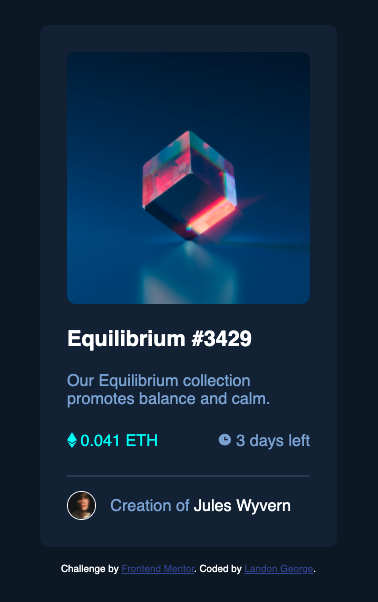

# Frontend Mentor - NFT preview card component solution

This is a solution to the [NFT preview card component challenge on Frontend Mentor](https://www.frontendmentor.io/challenges/nft-preview-card-component-SbdUL_w0U).

## Overview

### The challenge

Users should be able to:

- View the optimal layout depending on their device's screen size
- See hover states for interactive elements

### Screenshot

### Links

- [Solution]()
- [Live Site]()

## My process

### Built with

- HTML
- CSS (including Flexbox)

### What I learned

I learned how to overlay a div on top of another element in order to produce a hover effect.
